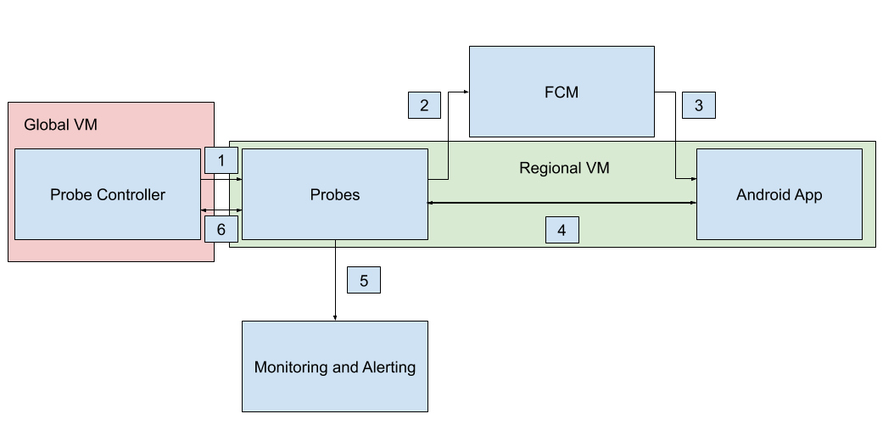

# FCM External Prober Design Doc

## Objective

This document aims to define features that need to be implemented in order to create end-to-end probers for Firebase Cloud Messaging (FCM). This project will be open-sourced, and may serve as a reference implementation for using FCM Send Service HTTP v1.

## Background

FCM’s current prober is dated and does not probe against the FCM Send Service HTTP v1 endpoint. The current prober probes against the FCM legacy HTTP endpoint.

## Overview

To build an end-to-end prober for FCM, we will need a way to send controlled messages to an application, and to be able to verify that the message was delivered correctly by FCM.
This requires the following:
* A controller that will generate instances of individual probes with specific configurations, each configuration representative of a single FCM use case
* A probe that represents a single test of a single use case, and is responsible for emulating an Android app. It will invoke the message send and message reception tools to communicate with the app, as is necessary to test the given use case. 
* A message send tool that will send a message through FCM to the Android app.
* An Android app that will receive and log messages.
* A message reception tool that will access the app’s logs to determine if a given message was successfully received.
* Logging and monitoring of data accrued from each probe, used to assess service performance over a given time period.
* Alerts to communicate to engineers that there is an issue with FCM to be addressed.

## Detailed Design

1. Global probe controller generates new regional VMs with new probe instances to test specific FCM use cases
1. Probe sends a message to FCM using the message send tool
1. FCM attempts to deliver the message to the Android app
1. Prober invokes the message reception tool to determine if the sent message was correctly received
1. Probe generates logs, which are monitored, and alerts are generated if performance falls below a given threshold
1. Controller and probe communicate occasionally to ensure probe is functioning correctly

### Global VM

The global VM is that which will contain the probe controller. Only one instance of the global VM will exist at one time, and will be created using Compute Engine.

### Regional VM

The regional VM will contain instances of probes and an Android app. This VM is referred to as “regional” because there may be several in existence at any given time, which is necessary to be able to evaluate the performance of specific regional servers. The regional VM will acquire its designated probes by contacting the global VM via gRPC, and will receive a protobuf containing probe behavior definitions. Each of the regional VMs will execute its probes indefinitely, until it is destroyed by the global VM upon termination of the prober, or it loses connection to the global VM. The regional VMs will be provided IAM service accounts, which serve to provide correct authentication scopes for GCP services. For why the Global VM and Regional VM exist and are separate entities, see the relevant design decision.

### Probe Controller

The probe controller is responsible for creating regional VMs, which are located on specified regional servers, in which the probe and emulated app will be located. These VMs will be created according to specifications found in the probe configuration file, allowing for the automatic creation of probes with varying behaviors. Once the regional VM has been created, the probe controller will initiate the probing process using gRPC, authenticated using TLS. In addition, the controller will use gRPC to communicate with the probe about its current status, which will allow it to destroy and re-create a probe if an error occurs, maintaining a set of probes derived from the configuration file at any given time.

### Configuration File

A configuration file will be used to dictate the characteristics of each probe and VM that will be created by the controller. The characteristics that can be modified include: probe type, server region, probe frequency, and timeout duration. In addition, the configuration file will be used to specify variables that are required during runtime, such as the ip of the VM on which the controller runs, or the location to which logs will be written. The configuration file will be in protocol buffer text format.

### Probe

Probes are responsible for emulating an instance of the Android app using [Android Virtual Device](https://developer.android.com/studio/run/managing-avds), which is available with the Android SDK. Upon starting, the virtual device is assigned an Android ID, which may be used for identifying individual emulated instances. The probe will install the target app on the device, and will then invoke the message send CLI tool in order to pass a message to FCM, and, ultimately, the app. In addition, the probe will invoke the message reception CLI tool with a given timestamp and probe type to determine if the corresponding message was received, and will be given the reception reception time, if the message was properly received.

### Android App

Upon starting, the Android app is responsible for generating a device registration token with FCM and logging it for the probe to acquire. Thereafter, it will receive messages from FCM and log them in text files within external storage. This data is stored in the external storage because writing to and acquiring data from external storage requires no user-specified permissions, simplifying the file I/O process. The presence of external storage is generally not guaranteed on a physical device, but the creation of an emulated external storage device can be achieved using AVD. The files will have names corresponding to the sending probe type and message send time, so they are uniquely identifiable in the case that multiple probes send to the same device. These log files will be available to the probe through the use of the message reception CLI tool to determine if a given message was properly received. For why an Android app is used instead of an alternative client, see the relevant design decision. 

### Message Send CLI Tool

The message send CLI tool will accept a series of strings representing fields to be supplied within the HTTP request to FCM. This will include: the app’s device registration token, send time, and sending probe type. The tool will then acquire the current time and include the representative string in the data field of the sent message. The request itself will be sent using cURL against the HTTP Send Service v1 API.

### Message Reception CLI Tool

The message reception tool will accept a date string and probe type from the probe, which will correspond to the naming convention of the file stored by the Android app representing the reception of a given message. The file will be acquired through the use of [Android Debug Bridge](https://developer.android.com/studio/command-line/adb), which allows for the acquisition of files within the emulated storage of the device. This tool will return information pertaining to the reception of the message, such as latency.

### Monitoring and Alerting

Log aggregation will be handled using Cloud Logging, whose functionality relies on the invocation of the gcloud command line tool. Monitoring of the data from the probe will be handled using Cloud Monitoring using custom metrics created from logs. Using this tool, dashboards can be easily created to provide meaningful visualization of the current performance of FCM. In this case, visualization will include SLO measurements for reception and latency for each type of probe, denoted by different names. In addition, visualizations will exist for all probes within a given region to address the use case in which a rollout causes issues as it propagates between server regions. Cloud Monitoring will also handle alerting on these metrics, should performance fall below a given threshold. The following metrics will be logged:
* ProbeRegion 
* ProbeType 
* SendTime 
* Latency 
* FCM Registration token 
* Status (resolved, timeout, error)

### Tested FCM Use Cases
* Probe app multiple times
* Probe app in multiple regions

## Design Decisions

### Android App for Receiving Messages Through FCM

FCM provides functionality to send messages to several types of clients, including those of Android, iOS, and web varieties. While any of these would be reasonable to use for probing, using an Android client appears to be the best decision, as the implementation is the most straightforward, ample tooling is available to interact with the application during its runtime, and communicating with an Android device appears to align best with FCM’s intended use case. It may be reasonable to consider extending the functionality of this project to clients of other types, but doing so would require non-trivial changes to the architecture of this project in order to generalize the creation of the client, as well as sending and reception verification of messages. 

### Probe and Emulated Android Device Located in Same VM

This decision was made to decrease the number of VMs that needed to be created when initializing a new probe and Android app. This also simplifies the acquisition of message reception information, as the probe will have access to AVD’s files within the scope of the same VM. If this were not the case, some networking protocol, like gRPC, would need to be used to access these files. This decision has the negative consequences of preventing a cross-region use case from being tested, but this case was deemed low-priority, as cross-region communication was likely to generate additional noise that may not be indicative of FCM’s performance.

### Probe Controller and Probe are not Located in Same VM

This decision was made to allow for probes to be deployed on different regional servers, which would address the use case in which a rolling deployment caused an issue, or to address the consumer-facing problem in which, for instance, FCM experiences a complete outage in a region that has a QPS low enough to not register on measurements of total service availability. This has the consequence of increasing the complexity of generating a new probe, which now requires the creation of a new VM to house the probe and the emulated Android app, as well as some sort of networking to allow the probe and controller to communicate.

### Multiple Probe instances delegated to a single regional VM

Originally, this design called for regional VMs to contain exactly one instance of one type of probe. This would require, then, multiple VMs in any region in which multiple probes were desired. Given the relatively high cost of creating and running additional VMs, it was decided that only one VM should be created per region, and should hold multiple probes, thus decreasing monetary operating costs. This change has a negative consequence of making monitoring topic-based notifications more difficult, as it will require running multiple Android emulators on a given VM, which is computationally expensive. In addition, sending many messages to one device could create noise in latency measurements, obscuring FCM’s true performance.

## Glossary

**Prober** - A tool that employs the use of one or more probes to generate artificial traffic to monitor the performance of a service
**Probe (n)** - Generates artificial traffic that reflects a specific use case of a service 
**Probe (v)** - The act of sending artificial traffic to a service and receiving a response for the purpose of monitoring
**Probe instance** - A probe initialized with a specific configuration during runtime